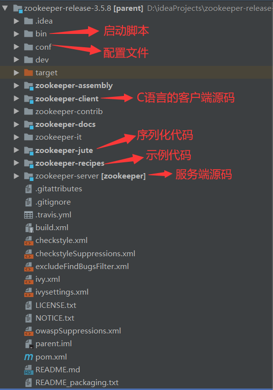
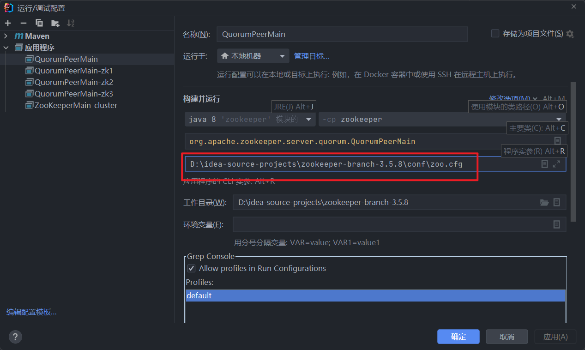
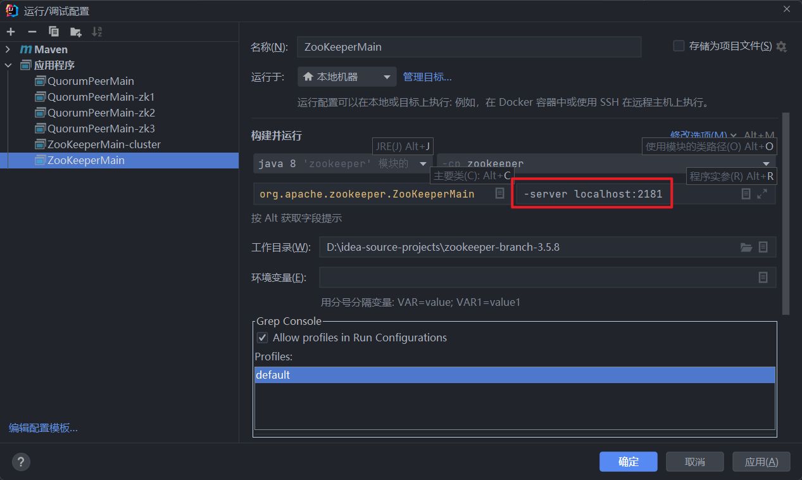

# zk-comments
## 学习zookeeper源码，加注释

- 带有 `// !` 注释的，为核心流程，需要步进
- 带有 `// #` 注释的，是主要流程，不需要步进

下载IDEA插件 `Better Comments` 可自定义高亮注释，方便查看源码


## 工程结构




## 编译源码

源码导入idea后，`org.apache.zookeeper.Version`类会报错，需要建一个辅助类

```java
package org.apache.zookeeper.version;

public interface Info {
    int MAJOR = 1;
    int MINOR = 0;
    int MICRO = 0;
    String QUALIFIER = null;
    int REVISION = -1;
    String REVISION_HASH = "1";
    String BUILD_DATE = "2020-10-15";
}
```

然后在根目录编译执行：
``` shell
mvn clean install -DskipTests
```

开源项目找入口类一般都是从启动脚本去找，可以从bin目录下的`zkServer.sh`或`zkServer.cmd`里找到启动主类运行即可


## zk服务端启动

zk脚本找入口 >>> `zkServer.sh` >>> `start)`参数 >>> `$ZOOMAIN` >>>  `org.apache.zookeeper.server.quorum.QuorumPeerMain` 找到主类

1. 找配置文件 conf >>> 默认的`zoo_sample.cfg`复制一份为`zoo.cfg`，修改dataDir目录到本地
2. 启动之前需要先将`zookeeper-server`项目里`pom.xml`文件里依赖的包(除了jline)的`scope`为`provided`这一行全部注释掉
3. 将conf文件夹里的`log4j.properties`文件复制一份到`zookeeper-server`项目的 `\target\classes` 目录下，这样项目启动时才会打印日志
4. idea主类启动时，配置参数，指定配置文件`Program arguments`




## zk客户端启动

配置启动参数，启动ZooKeeperMain
```
-server localhost:2181
```




## 源码启动集群

复制三份配置文件，分别为`zoo-1.cfg`，`zoo-2.cfg`，`zoo-1.cfg`

配置如下，区分dataDir和clientPort端口号

```properties
# zoo-1.cfg
dataDir=D:/idea-source-projects/zookeeper-branch-3.5.8/data/zk1

clientPort=2181

server.1=127.0.0.1:2888:3888
server.2=127.0.0.1:2889:3889
server.3=127.0.0.1:2890:3890
```

```properties
# zoo-2.cfg
dataDir=D:/idea-source-projects/zookeeper-branch-3.5.8/data/zk2

clientPort=2182

server.1=127.0.0.1:2888:3888
server.2=127.0.0.1:2889:3889
server.3=127.0.0.1:2890:3890
```

```properties
# zoo-3.cfg
dataDir=D:/idea-source-projects/zookeeper-branch-3.5.8/data/zk3

clientPort=2183

server.1=127.0.0.1:2888:3888
server.2=127.0.0.1:2889:3889
server.3=127.0.0.1:2890:3890
```


分别创建dataDir配置的目录 zk1、zk2、zk3，以及目录下`myid`文件，myid内容分别为1、2、3

多实例启动`QuorumPeerMain`，分别配置专属的`zoo-1.cfg`、`zoo-2.cfg`、`zoo-3.cfg`配置文件

启动`ZookeeperMain`,配置参数
```
-server localhost:2181,localhost:2182,localhost:2183
```
启动

控制台输入

```shell
get /zookeeper/config

server.1=127.0.0.1:2888:3888:participant
server.2=127.0.0.1:2889:3889:participant
server.3=127.0.0.1:2890:3890:participant
version=0
```
